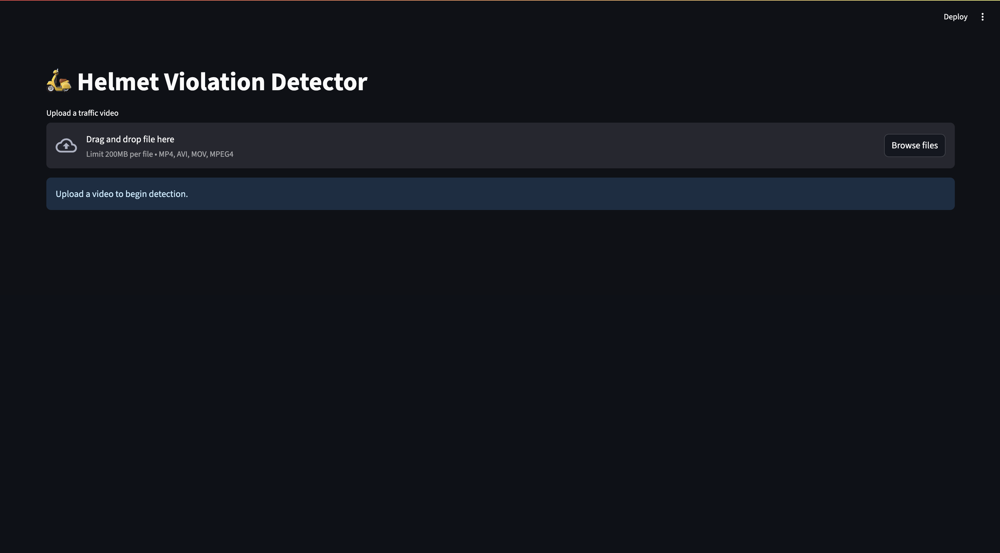

# 🚨 Road Safety Assistant - Helmet Violation Detection System

A real-time computer vision system to detect **helmet violations** using YOLOv8 and OpenCV, with an interactive Streamlit dashboard. This project helps improve road safety by automatically identifying motorcyclists riding **without helmets** from traffic surveillance videos.

 <!-- Replace with your demo gif/video -->

---

## 📌 Features

- ✅ Real-time helmet detection using **YOLOv8**
- 🚷 Logs and saves cropped images of **helmet violators**
- 🧠 Avoids duplicate entries using **object tracking**
- 📈 Interactive **Streamlit dashboard** to:
  - Upload traffic videos
  - View logged violations
  - See cropped snapshots
  - Export logs as CSV

---

## 📸 Demo



---

## 🚀 Getting Started

### 1. Clone the Repository

```bash
git clone https://github.com/your-username/road-safety-assistant.git
cd road-safety-assistant
```
### 2. Install Requirements
```bash
pip install -r requirements.txt
```

### 3. Download YOLOv8 Helmet Model
Place the YOLOv8 model (trained for helmet/no-helmet detection) in the `models/` directory.

Recommended: 
- `helmet_yolov8.pt` (or your own trained model)
```bash
models/
└── helmet_yolov8.pt
```

### 4. Run the Streamlit App
```bash
streamlit run app.py
```
## 📁 Project Structure
```commandline
road_safety_assistant/
├── app.py                     # Streamlit UI
├── detectors/
│   └── yolo_detector.py       # YOLOv8 detection + tracking
├── utils/
│   └── ui_utils.py            # Video processing, logging
├── data/
│   └── test_videos/           # Input videos
├── logs/
│   ├── frames/                # Cropped violation images
│   └── violations.csv         # Log of all violations
├── models/
│   └── helmet_yolov8.pt       # YOLOv8 helmet detection model
├── requirements.txt
└── README.md
```
## 📊 Output
`📁 logs/violations.csv:`
```bash
timestamp,track_id,class,confidence,image
2025-07-06 17:12:34,2,Without Helmet,0.89,logs/frames/violation_2025-07-06_17-12-34.jpg
```
`📁 logs/frames/:`contains all cropped images of violators.

## 🧠 Model Information
The model is trained on a helmet detection dataset with two classes:
- `With Helmet`
- `Without Helmet`